# Day in the Life of a Row

How a single record travels from CSV to Excel report. Uses the L1 Reconciliation recipe as the concrete example.

## Pipeline Overview

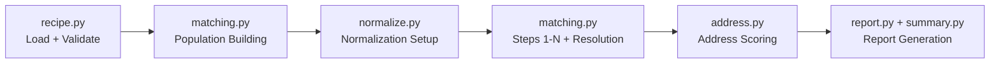

Each stage below maps to a node in this diagram.

---

## Our Row

```
vendor_id:      V712345
l3_fmly_nm:     Vanteon Systems, Inc.
hq_addr1:       123 Main Blvd Suite 200
hq_addr2:       Floor 7
hq_addr3:       New York NY 10001
l1_fmly_nm:     PLACEHOLDER_PARENT       (invalid -- migrated)
tpty_l1_id:     S99999                   (invalid -- migrated)
cntrct_cmpl_dt: 2019-01-15              (invalid -- migrated)
data_entry_type: Migrated
rq_intk_user:   Data Migration
tpty_assm_nm:   Vanteon Security Review
```

This row lives in `tp_multi_pop_dataset.csv`. It has a V7 vendor ID so it's a migration candidate with broken parent fields.

---

## Stage 1: Recipe Loading (`recipe.py`)

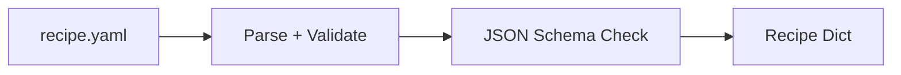

**Entry:** `__main__.py` -> `recipe.load_recipe("config/recipes/l1_reconciliation.yaml")`

The recipe YAML is parsed and validated against `config/recipe_schema.json` via `validate_recipe()`. Critical errors (missing `name`, `sources`, `populations`, `steps`, `output`) raise ValueError. Non-fatal issues (unrecognized keys, missing `record_key`) emit warnings.

The recipe defines:
- Two sources: `core_parent` and `multi_pop`
- Three populations: `pop1`, `garbage`, `pop3`
- Four matching steps
- Normalization config paths for stopwords and aliases

---

## Stage 2: Source Loading (`recipe.py`)

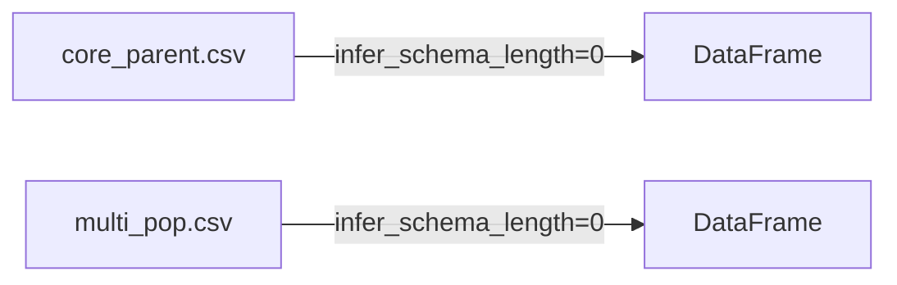

**Entry:** `recipe.load_source()` for each source in the recipe

```python
sources["core_parent"] = load_source({"file": "core_parent_export.csv"}, "data")
sources["multi_pop"] = load_source({"file": "tp_multi_pop_dataset.csv"}, "data")
```

`load_source()` auto-detects format from file extension. CSV files are loaded with `infer_schema_length=0` (all columns as strings -- no type guessing). Our row is now one of thousands in the `multi_pop` DataFrame.

---

## Stage 3: Population Building (`matching.py`)

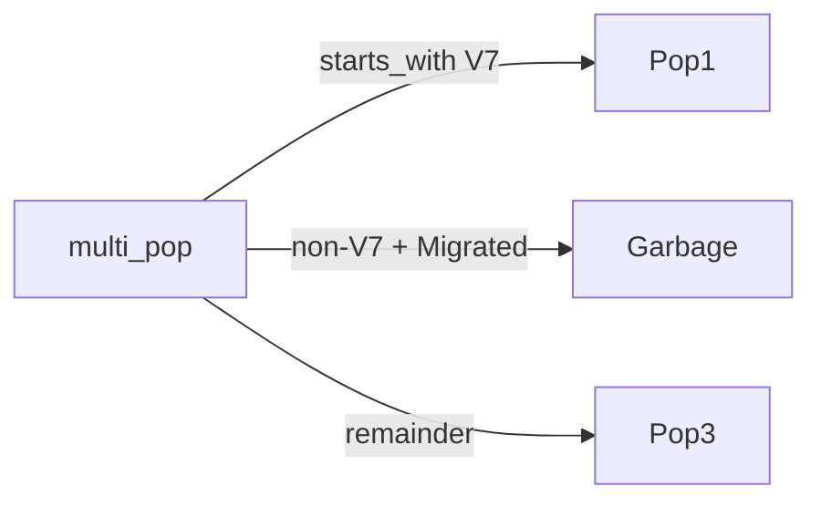

**Entry:** `matching.run_pipeline()` -> population loop

### Pop1 (our row's destination)

Filter: `vendor_id starts_with "V7"`

`recipe.build_filter_expr()` converts the filter DSL to a Polars expression:

```python
pl.col("vendor_id").cast(pl.String).str.starts_with("V7")
```

Our row has `vendor_id = "V712345"` -- it passes. It's now in Pop1.

### Garbage

Filter: `vendor_id not_starts_with "V7" AND data_entry_type eq "Migrated" AND rq_intk_user contains_any ["Data Migration", "Goblindor"]`

Our row starts with V7, so the first condition fails. Even though it matches the other conditions, the AND join means it's excluded from Garbage. (Garbage is for non-V7 migrated records.)

### Pop3 (remainder)

Pop3 has `filter: []` -- it's the remainder population. The pipeline computes it by taking the full `multi_pop` source and subtracting everything that matched Pop1's filter and Garbage's filter. Garbage (with `action: exclude`) is specifically excluded from the remainder -- this is how garbage populations help define Pop3 without being matched against.

Our row already matched Pop1, so it's excluded from Pop3. Pop3 contains only non-V7, non-garbage records.

### Field Validation

`recipe.validate_fields()` checks that all field references in the recipe (match_fields, address_support, inherit, filters) exist in the actual DataFrames. Errors on critical fields (match_fields, inherit), warnings on optional ones (address_support, date_gate).

---

## Stage 4: Normalization Setup (`normalize.py`)

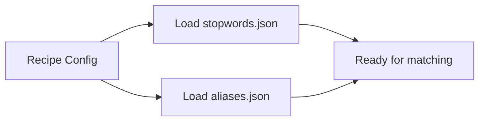

**Entry:** `run_pipeline()` reads `recipe.normalization`

```yaml
normalization:
  stopwords: config/stopwords.json
  aliases: config/aliases.json
```

`stopwords.json` is loaded and flattened (if categorized by type like `{"name": [...], "address": [...]}`, all lists are merged into one). `aliases.json` is loaded as a dict.

These are passed to every matching step for use in the `normalized` tier. The `record_key` is resolved -- Pop1 has `record_key: vendor_id`, so `track_field = "vendor_id"`. This is the unique identifier for dedup and unmatched tracking.

---

## Stage 5: Matching Step 1 -- Exact to core_parent (`matching.py` + `address.py`)

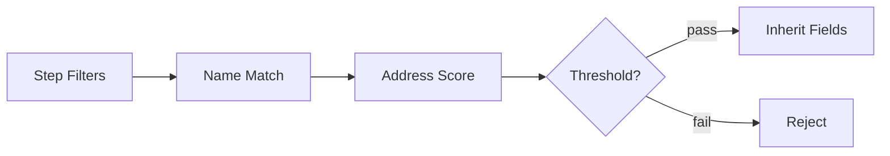

**Entry:** `run_matching_step(pop1_df, core_parent_df, step_config)`

### 5a. Step Filters (Date Gate)

The step has a `date_gate` (filters stale destination records):

```yaml
date_gate:
  field: Updated
  max_age_years: 2
  applies_to: destination
```

The `applies_to` field controls which side is filtered: `destination` (default), `source`, or `both`.

`_normalize_step_filters()` converts this to a generic filter:

```python
{"field": "Updated", "op": "max_age_years", "value": 2, "applies_to": "destination"}
```

`apply_date_gate()` tries 5 date formats on the `Updated` column of core_parent, computes a cutoff date (today minus 2*365 days), and filters out stale records. Pop1 (source) is NOT filtered -- its dates are invalid.

### 5b. Name Matching (Exact)

`match_names_exact(pop1_df, core_parent_df, "l3_fmly_nm", "Vendor Name", tiers=["raw", "clean"])`

**Raw tier:**
- Creates `_match_key` from `l3_fmly_nm` (as-is): `"Vanteon Systems, Inc."`
- Creates `_match_key` from `Vendor Name` (as-is) on core_parent
- Polars inner join on `_match_key`
- If core_parent has `"Vanteon Systems, Inc."` exactly -- match found
- Suppose it doesn't (core_parent has `"VANTEON SYSTEMS INC"`) -- no match at raw tier

**Clean tier:**
- `clean("Vanteon Systems, Inc.")` -> `"vanteon systems inc"` (lowercase, strip commas/periods)
- `clean("VANTEON SYSTEMS INC")` -> `"vanteon systems inc"`
- Polars inner join -- match found at clean tier

Result: matched with `match_tier: clean`

Dedup by `vendor_id` (record_key) with tier priority -- raw=0, clean=1. If both tiers matched, raw wins (lower priority number). Here only clean matched.

### 5c. Address Scoring

Now that name matching found a pair, address scoring runs on the matched pair.

`score_addresses_batch()` calls `score_address_multi_tier()` for each matched pair:

**Build variants:**

Source (with 3-field recipe):
```
addr1_only:  "123 Main Blvd Suite 200"
addr2_only:  "Floor 7"
addr3_only:  "New York NY 10001"
addr_merged: "123 Main Blvd Suite 200 Floor 7 New York NY 10001"
fields:      ["123 Main Blvd Suite 200", "Floor 7", "New York NY 10001"]
```

Destination (from core_parent, say `Address1 = "123 MAIN BOULEVARD STE 200"`):
```
addr1_only:  "123 MAIN BOULEVARD STE 200"
addr2_only:  ""
addr3_only:  ""
addr_merged: "123 MAIN BOULEVARD STE 200"
fields:      ["123 MAIN BOULEVARD STE 200", "", ""]
```

With the 2-field recipe, only `addr1_only`, `addr2_only` and `addr_merged` are generated (no `fields` list or `addr3_only`).

**Per tier (recipe says `tiers: [clean]`):**

Comparisons are generated dynamically from the number of address fields and evaluated in order: specific field pairs first, then merged. With the 3-field recipe there are 10 comparisons: all 3×3 individual field combos (addr1<>addr1, addr1<>addr2, ... addr3<>addr3) then merged<>merged. With the 2-field recipe there are 5 (2×2 + merged). Source and destination can have different field counts -- with 3 source and 2 dest fields: 3×2 + 1 = 7 comparisons. On equal scores, the first-evaluated comparison wins (specific preferred over merged).

Taking addr1<>addr1 at clean tier:
```
normalize.apply_tier("123 Main Blvd Suite 200", "clean")
  -> "123 main blvd suite 200"

normalize.apply_tier("123 MAIN BOULEVARD STE 200", "clean")
  -> "123 main boulevard ste 200"
```

**Full score:** `rfuzz.token_sort_ratio("123 main blvd suite 200", "123 main boulevard ste 200")` -> ~82

**Parse (built-in tokenizer):**
```
classify_tokens("123 main blvd suite 200"):
  street_suffix: "blvd"
  street_name: "123 main"     (tokens before first suffix)
  unit: "suite 200"

classify_tokens("123 main boulevard ste 200"):
  street_suffix: "boulevard"
  street_name: "123 main"
  unit: "ste 200"
```

**Street score:** `rfuzz.ratio("123 main", "123 main")` -> 100.0
`street_match = True` (100 >= 80)

**Weighted:** `100.0 * 0.6 + 82 * 0.4 = 92.8`

The best comparison and tier combination wins. Each tier × comparison pair is scored and the highest weighted score wins. See [how-scoring-works.md](how-scoring-works.md) for detailed worked examples with all tiers and comparison types.

Result:
```
addr_score: 92.8
addr_street_match: True
addr_comparison: "addr1<>addr1"
addr_tier: "clean"
```

### 5d. Threshold Check

Recipe: `address_support.threshold: 75`

92.8 >= 75 -- passes. If it were below 75, the record would be rejected from this step (tracked in `all_rejections` with reason `addr_below_threshold`).

### 5e. Street Match Gate

This recipe does NOT set `require_street_match: true`, so no gate check. The `addr_street_match` value is informational only.

### 5f. Inherit

```yaml
inherit:
  - source: Supplier Name   -> as: derived_l1_name
  - source: Supplier ID     -> as: derived_l1_id
```

The code looks for `Supplier Name_dst` first, then falls back to `Supplier Name`. When both source and destination DataFrames share a column name, Polars adds a `_dst` suffix to the destination side during the join (see [Polars join docs](https://docs.pola.rs/api/python/stable/reference/dataframe/api/polars.DataFrame.join.html)). So `Supplier Name_dst` is the destination's value. The matched destination's supplier fields are copied into new columns:
```
derived_l1_name: "Vanteon Holdings Group"
derived_l1_id:   "S00472"
```

### 5g. Step Tagging

The matched row gets:
```
match_step: "Match Pop1 to core_parent"
_step_order: 0
```

Our row is now in `all_matched`. Its `vendor_id` is added to `matched_source_keys`.

---

## Stage 6: Remaining Steps 2-4 (`matching.py`)

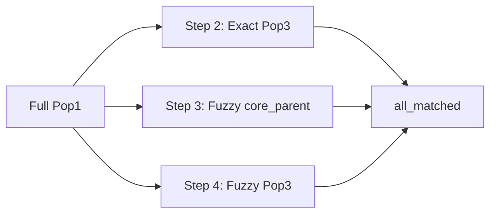

Steps 2-4 also receive the full Pop1 DataFrame (including our row). They run independently:

- **Step 2:** Exact to Pop3 -- our row might match here too
- **Step 3:** Fuzzy to core_parent (threshold 70) -- our row might match again
- **Step 4:** Fuzzy to Pop3 (threshold 70) -- and here

All matches from all steps are collected in `all_matched`.

---

## Stage 7: Resolution (`matching.py`)

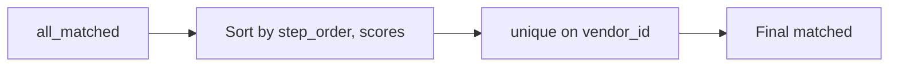

**Entry:** `run_pipeline()` resolution phase

All matched DataFrames are concatenated (`pl.concat(all_matched, how="diagonal")`).

Sort order: `_step_order ASC, name_score DESC, addr_score DESC`

Dedup: `unique(subset=["vendor_id"], keep="first")`

Our row matched in Step 1 (step_order=0). Even if it also matched in Steps 3 or 4, Step 1 wins because it has the lowest step_order. If it matched in Steps 1 AND 2 (both step_order 0 and 1), Step 1 still wins.

Exact matches get `name_score = 100` (fill_null).

Internal columns (`_step_order`, `_tier_priority`, `_match_key`) are dropped.

---

## Stage 8: Unmatched Tracking (`matching.py`)

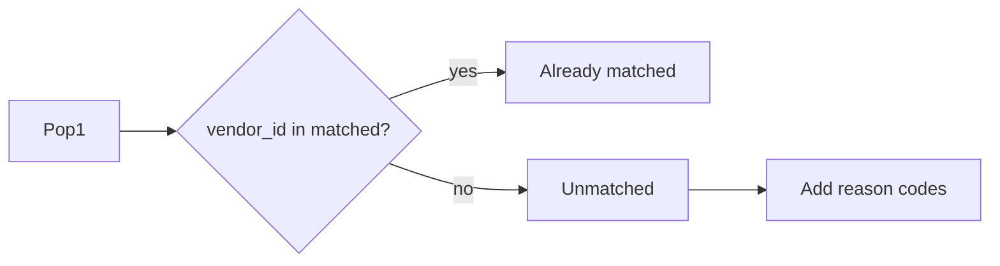

All Pop1 records whose `vendor_id` is NOT in `matched_source_keys` become unmatched.

Unmatched records get reason codes:
- `no_name_match` -- never found a name match in any step
- `addr_below_threshold` -- name matched but address score was below threshold in every step
- `street_mismatch` -- name matched but street gate rejected it (only when `require_street_match: true`)

The `rejection_step` and `best_rejected_score` columns show which step came closest.

Our row matched, so it's not in the unmatched set.

---

## Stage 9: Report Generation (`report.py` + `summary.py`)

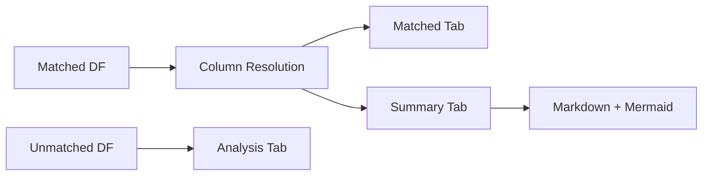

**Entry:** `report.generate_report(matched_df, unmatched_df, output_path, stats, recipe)`

### Column Resolution

The recipe defines `output.columns.matched` and `output.columns.analysis`. For matched:

```yaml
columns:
  matched:
    - field: l3_fmly_nm
      header: Source L3 Name
    - field: derived_l1_name
      header: Derived L1 Name
    - fields: [Vendor Name, l3_fmly_nm_dst]
      header: Dest L3 Name
    # ... etc
```

Variant columns (entries with `fields: [...]`) are coalesced -- `_coalesce_variant_columns()` uses `pl.coalesce()` to pick the first non-null value from the variant list. This handles the fact that Step 1 produces `Vendor Name` (from core_parent) while Step 2 produces `l3_fmly_nm_dst` (from Pop3).

### Excel Output

Three tabs are written to the `.xlsx` file:

**Summary tab** (inserted at position 0 by `summary.write_summary_tab()`):
- Recipe name and description
- Population descriptions with record counts
- Matched/unmatched counts
- Step table with method, thresholds and per-step match counts
- Pipeline timing

**Matched tab:**
Our row appears as one row with columns:
```
Source L3 Name:      Vanteon Systems, Inc.
Source Vendor ID:    V712345
Assessment Name:     Vanteon Security Review
Source Address 1:    123 Main Blvd Suite 200
Source Address 2:    Floor 7
Derived L1 Name:    Vanteon Holdings Group
Derived L1 ID:      S00472
Match Source:        Match Pop1 to core_parent
Match Tier:          clean
Name Score:          100
Address Score:       92.8
Street Match:        True
Address Comparison:  addr1<>addr1
Address Tier:        clean
Dest L3 Name:        VANTEON SYSTEMS INC
Dest Address 1:      123 MAIN BOULEVARD STE 200
Dest Address 2:      (empty)
```

Score cells get conditional formatting: green (>=80), yellow (>=60), red (<60). Our 92.8 is green.

**Analysis tab:**
Contains only unmatched records. Our row isn't here.

### Markdown Summary

A `_summary.md` file is generated alongside the Excel file with:
- Same content as the Summary tab
- A Mermaid cascade diagram showing record flow through steps

---

## The Full Pipeline in One Diagram

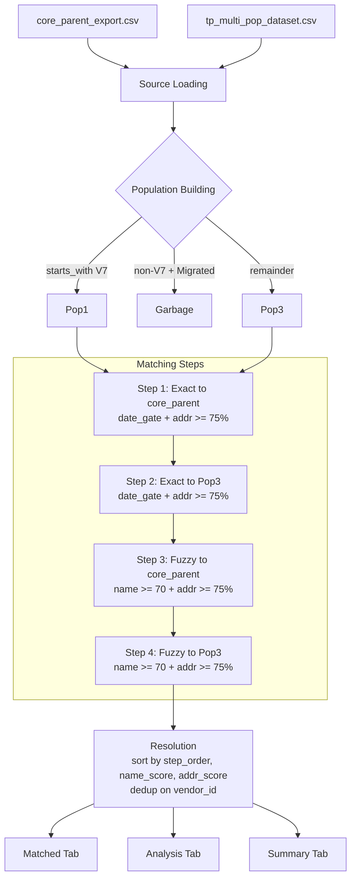

---

## Key Takeaways

1. **Normalization tiers are independent for names and addresses.** Name matching used `[raw, clean]`. Address scoring used `[clean]` (per recipe). They can produce different tier labels in the report.

2. **All steps see all source records.** The "cascade" is resolved at the end via dedup, not by excluding matched records from later steps.

3. **Address scoring runs on matched pairs only.** It never runs on the full N×M cross product -- only on records that already passed name matching.

4. **Score columns are from different systems.** `name_score` comes from the join (100 for exact, 0-100 for fuzzy). `addr_score` comes from the weighted street+full combination. They're independent.

5. **Variant columns handle cross-step column naming.** When Step 1 matches to core_parent (column `Vendor Name`) and Step 2 matches to Pop3 (column `l3_fmly_nm_dst`), coalescing picks the right value for the "Dest L3 Name" report column.

6. **Address field count is configurable.** The `address_support.source` and `address_support.destination` lists in the recipe control how many address columns are compared. The code generates merged + N×M individual comparisons dynamically. Source and dest can have different field counts (asymmetric comparison).

7. **Multi-phase pipelines chain phases sequentially.** This document describes a single-phase recipe. Multi-phase recipes (`phases:` key) run multiple matching passes where each phase can consume the prior phase's output via `_previous_matched`. See `docs/multi-phase-recipes.md` for details.